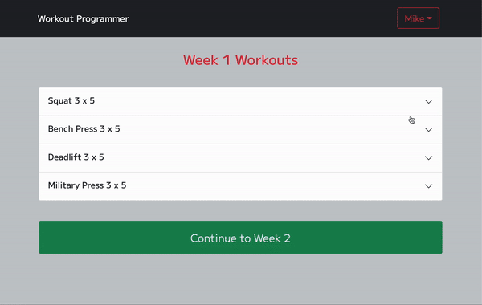
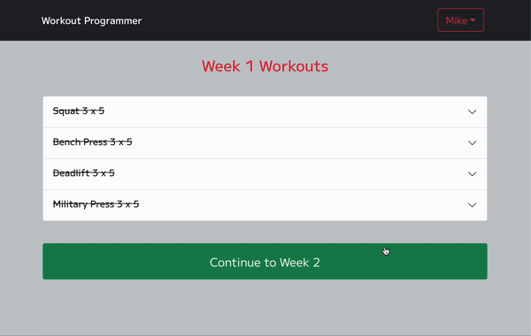
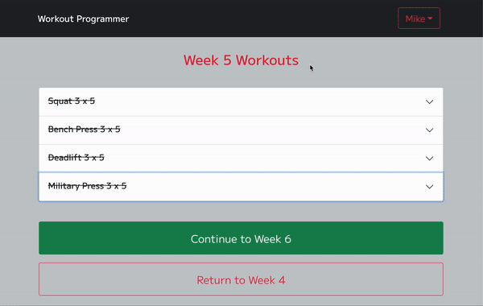

# Workout Programmer

Workout Programmer is a custom 20-week workout generator tailored to your current level of fitness.

***

## *Disclaimer*

You should consult your physician or other health care professional before beginning any new fitness regimen. The use of any information provided on this site is solely at your own risk.

***

## Description

Based on the concepts developed in Jim Wendler's 5-3-1 program, the Workout Programmer centers around four main compound movements: 

* Squat
* Bench Press
* Deadlift
* Military Press

The program consists of five four-week phases with specific rep/weight combinations based on your one rep maximum for each of the four main lifts. 

At the end of each four-week phase, the baseline maximum from which the workout weights are derived increases by five pounds for Bench Press and Military Press and ten pounds for Squat and Deadlift.

## Usage

### Signup Process

It all begins with the four main exercises.

The application will ask the user to enter the heaviest weight they have successfully lifted for each exercise as well as the respective number of repetitions completed.

Upon signing up, the application will calculate the user's one rep maxes and use those to generate the weights prescribed for each set of the 20-week workout.

### Workouts

Once the user logs in, workouts are displayed on the homepage for the user's current week. 

Each week, the rep scheme changes as the weights become progressively heavier, though remain below the user's calculated one repetition maximum. 

Every fourth week is a deloading week, consisting of lighter weights and meant to promote recovery before beginning the next phase.

#### Sets and Weights

Click on the exercises to open their respective accordion, revealing the specific weight needed for each set.

#### Plates

A "View Plates / Side" button displays which plates are needed on each side of a standard barbell to achieve the prescribed weight for the set (using the fewest number of plates, of course).

For instance, if the specified weight is 180 *lbs*, the popover will show:

* 45 *lb*: 1
* 10 *lb*: 2
* 2.5 *lb*: 1

If the specified weight is 185 *lbs*:

* 45 *lb*: 1
* 25 *lb*: 1

#### The Final Set

The final set for every week (with the exception of the deloading week every fourth week) is a maximum-effort set, meaning the user will do as many reps as **safely** possible. 

The set is designed to be the most difficult and the most rewarding. Enter the number of reps you have completed and, who knows, you may have even set a new personal record. 

More on that later...

#### Advancing Weeks

As simple as pressing the green button at the bottom of the page to advance, and the red button to return.

#### Accessory Exercises

Once the user presses the "Complete" button, the sets/weights for the main exercise are replaced by suggested accessory exercises. 

These are a good starting point for the remainder of the day's workout but are decidedly less important than the main exercise for the day.

### Profile

Accessible via the dropdown menu on the right side of the navigation bar, the user profile showcases the user's progress through the program.

#### Personal Records

For each of the four main exercises, the profile displays the user's basline personal record upon signup as well as tracks their current personal record as they continue with the workout regimen.

As the last set of a workout (deloading days excluded) features the heaviest weights and calls for as many reps as possible, it follows that personal records will be made on these sets.

Therefore, as detailed earlier, these sets allow the user to enter the number of completed repetitions, which will then be used to calculate the "one rep maximum" achieved.

If that number is greater than the user's current one rep maximum, it will be saved on their profile.

For instance, if a user signs up with their heaviest Bench Press as six reps with 185 *lbs*, their starting personal record would be 220 *lbs*. On week three of the program, the final set will call for the user to Bench Press as many reps as possible with 190 *lbs*.

If the user completes seven reps, their new calculated one rep maximum / personal record would be 240 *lbs* and will be saved to their profile. 

