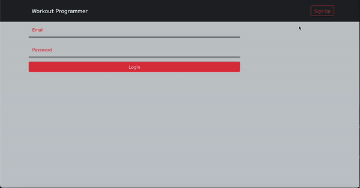

# Workout Programmer

Workout Programmer is a custom 20-week workout generator tailored to your current level of fitness.

## Description

Based on the concepts developed in Jim Wendler's 5-3-1 program, the Workout Programmer centers around four main compound movements: 

* Squat
* Bench Press
* Deadlift
* Military Press

The program consists of five four-week phases with specific rep/weight combinations based on your one rep maximum for each of the four main lifts.

## Usage

It all begins with the four main lifts.

Most people don't know their one rep maximums, and it can be stressful on your body to attempt a one rep max. Therefore, the application will ask the user to enter the heaviest weight they have successfully lifted for each of the four main exercises as well as the respective number of repetitions completed.

Upon signing up, the application will calculate the user's one rep maxes and use those to generate the weights prescribed for each set of the 20-week workout.

